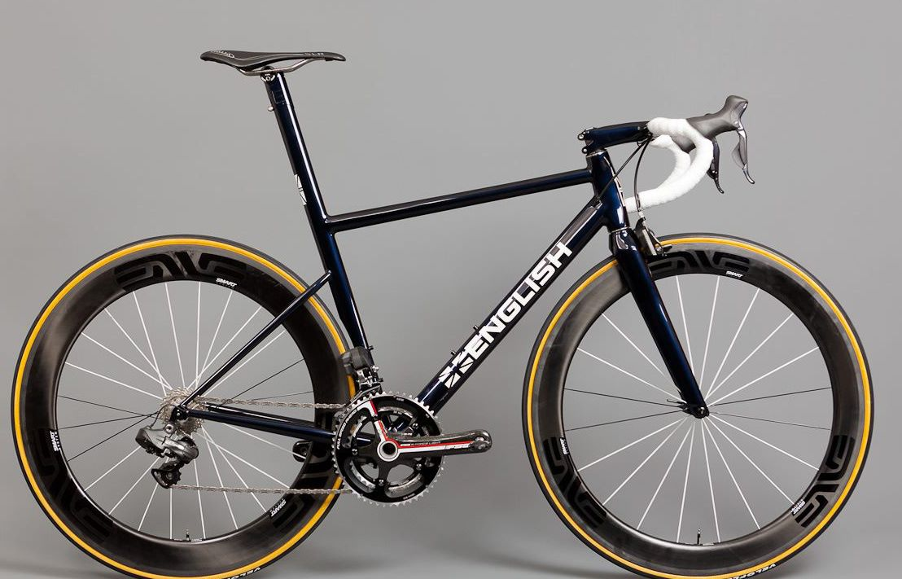

# My Rust Playpen   


<!-- PROJECT LOGO -->
<br />
<p align="center">
  <a href="https://github.com/dbrowne/playpen_rust.git">
    
  </a>

<h3 align="center">Algo implementations in Rust</h3>

  <p align="center">
    Sends a message on a port n times with a delay and expect a response
    <br />
    <br />
    <br />
    <a href="https://github.com/dbrowne/playpen_rust/issues">Report Bug</a>
    <br/>
    <a href="https://github.com/dbrowne/playpen_rust/issues">Request Feature</a>
  </p>

[![Contributors][contributors-shield]][contributors-url]
[![Forks][forks-shield]][forks-url]
[![Stargazers][stars-shield]][stars-url]
[![Issues][issues-shield]][issues-url]
[![MIT License][license-shield]][license-url]
[![LinkedIn][linkedin-shield]][linkedin-url]


<!-- TABLE OF CONTENTS -->
<details open="open">
  <summary><h2 style="display: inline-block">Table of Contents</h2></summary>
  <ol>
    <li>
      <a href="#about-the-project">About The Project</a>
      <ul>
        <li><a href="#built-with">Built With</a></li>
      </ul>
    </li>
    <li>
      <a href="#getting-started">Getting Started</a>
      <ul>
        <li><a href="#prerequisites">Prerequisites</a></li>
        <li><a href="#installation">Installation</a></li>
      </ul>
    </li>
    <li><a href="#usage">Usage</a></li>
    <li><a href="#roadmap">Roadmap</a></li>
    <li><a href="#contributing">Contributing</a></li>
    <li><a href="#license">License</a></li>
    <li><a href="#contact">Contact</a></li>
    <li><a href="#acknowledgements">Acknowledgements</a></li>
  </ol>
</details>


<!-- ABOUT THE PROJECT -->

## About The Project

A simple TCP client written in rust. Might be useful for some

### Built With

* [Rust](https://www.rust-lang.org/tools/install)

<!-- GETTING STARTED -->

## Getting Started

To get a local copy up and running follow these simple steps.

### Prerequisites

* rust
  ```sh
  curl --proto '=https' --tlsv1.2 -sSf https://sh.rustup.rs | sh

  ```

### Installation

1. Clone the repo
   ```sh
   git clone https://github.com/dbrowne/playpen_rust.git
   ```

<!-- USAGE EXAMPLES -->

## Usage

Whatever makes sense for you


<!-- ROADMAP -->

## Roadmap

more and more rust code


<!-- CONTRIBUTING -->

## Contributing

If you really want to...

1. Fork the Project
2. Create your Feature Branch (`git checkout -b feature/AmazingFeature`)
3. Commit your Changes (`git commit -m 'Add some AmazingFeature'`)
4. Push to the Branch (`git push origin feature/AmazingFeature`)
5. Open a Pull Request

<!-- LICENSE -->

## License

Distributed under the MIT License. See `LICENSE` for more information.


<!-- CONTACT -->

## Contact

Dwight J. Browne - [@dwightb2](https://twitter.com/dwightb2) - dwight[-dot-]browne[-at-]colorado[-dot-]edu

Project Link: [https://github.com/dbrowne/playpen_rust.git](https://github.com/dbrowne/playpen_rust.git)


<!-- ACKNOWLEDGEMENTS -->

## Acknowledgements

* [google](www.google.com)
* [stackoverflow](www.stackoverflow.com)
* [docs.rs](https://docs.rs/)

<!-- MARKDOWN LINKS & IMAGES -->
<!-- https://www.markdownguide.org/basic-syntax/#reference-style-links -->

[contributors-shield]: https://img.shields.io/github/contributors/dbrowne/playpen_rust

[contributors-url]: https://github.com/dbrowne/playpen_rust/graphs/contributors

[forks-shield]: https://img.shields.io/github/forks/dbrowne/playpen_rust

[forks-url]: https://github.com/dbrowne/playpen_rust/network/members

[stars-shield]: https://img.shields.io/github/stars/dbrowne/playpen_rust

[stars-url]: https://github.com/dbrowne/playpen_rust/stargazers

[issues-shield]: https://img.shields.io/github/issues/dbrowne/playpen_rust

[issues-url]: https://github.com/dbrowne/playpen_rust/issues

[license-shield]: https://img.shields.io/github/license/dbrowne/playpen_rust

[license-url]: https://github.com/dbrowne/playpen_rust/blob/master/LICENSE.txt

[linkedin-shield]: https://img.shields.io/badge/-LinkedIn-black.svg?style=for-the-badge&logo=linkedin&colorB=555

[linkedin-url]: https://linkedin.com/in/dwightbrowne

